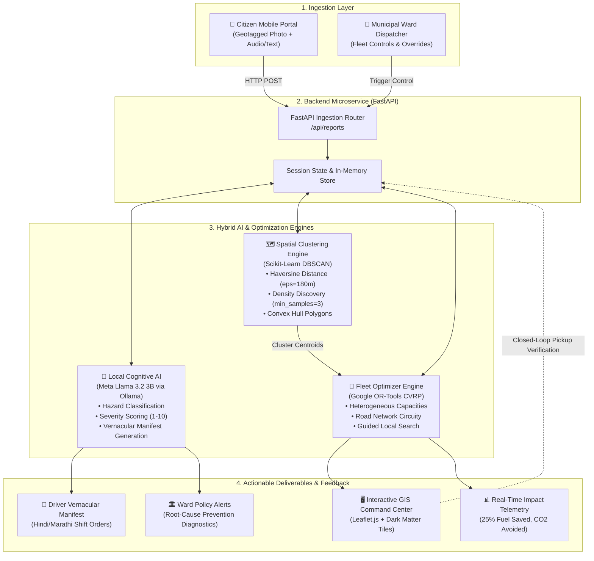
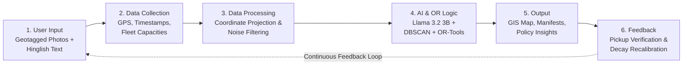
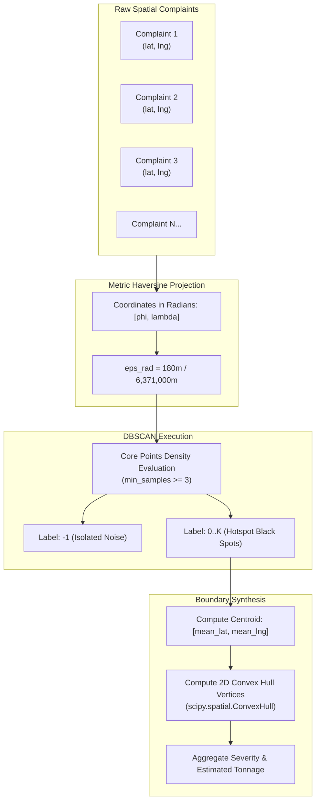
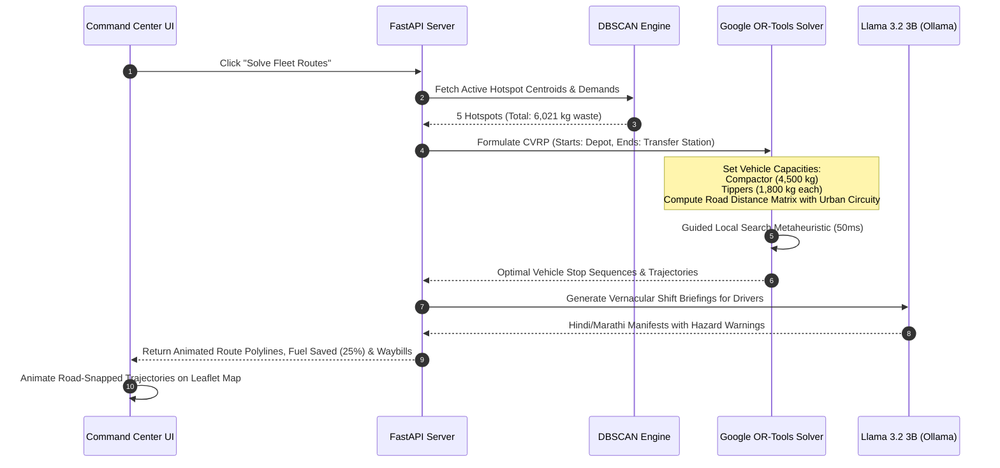
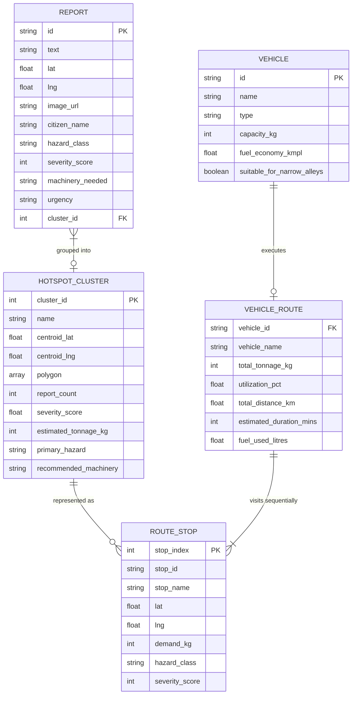

# SwachhRoute AI 🚛🌱
### Autonomous Geospatial Hotspot Clustering & Dynamic Fleet Route Optimizer
**Problem Statement:** CS11 — Geospatial Environment: Mapping Waste-Dumping Hotspots and Improving Collection Routes  
**Hackathon:** NeuraMorphix HackForge 2026  
**Team:** Stackverse-labs  
**Lead:** Omkar Karibasappa Bhandari  
**Live Repository:** [https://github.com/Omkar2005494/SwachhRoute-AI](https://github.com/Omkar2005494/SwachhRoute-AI)  

---

## 🌟 Overview & Problem Context

In Indian cities, **75% to 85% of municipal solid waste expenditure is consumed purely by transport logistics and diesel fuel** (Central Pollution Control Board / NITI Aayog). Yet, urban centers remain plagued by recurring illegal "black spots" because current citizen grievance platforms (e.g., Swachhata-MoHUA) operate as reactive ticketing tools that clean spots only to see them recur within 48 hours.

**SwachhRoute AI** bridges this chasm by connecting crowdsourced citizen complaints directly to municipal fleet logistics:
1. **Local Cognitive AI (Meta Llama 3.2 3B via Ollama):** Extracts hazard classification, severity scores (1–10), and required machinery from messy colloquial Hinglish/vernacular text—running **100% locally** with zero cloud costs and strict DPDP Act 2023 compliance.
2. **Spatio-Temporal Clustering (DBSCAN):** Groups scattered citizen complaints into persistent black-spot convex hulls, filtering out single-use litter noise.
3. **Dynamic Fleet Routing (Google OR-Tools CVRP):** Solves the Capacitated Vehicle Routing Problem across a heterogeneous fleet (heavy compactors vs. mini tippers) using real road network distances, cutting dead mileage and diesel burn by **10%–25%**.
4. **Root-Cause Prevention & Driver Briefings:** Generates localized vernacular shift manifests for drivers and diagnostic policy recommendations for ward commissioners.

---

## 📊 Flowcharts & System Architecture

### 1. End-to-End System Topology



---

### 2. Operational Data Pipeline (Slide 3 Flowchart)



---

### 3. Spatial DBSCAN & Convex Hull Geometry



---

### 4. Google OR-Tools CVRP Optimization Workflow



---

## 🗄️ Entity-Relationship Model



---

## 🚀 Quickstart & Demo Execution

### Prerequisites
* Python 3.10+ (Tested on Python 3.14 on macOS Apple Silicon M2)
* Local Ollama with `llama3.2:3b` (Optional: built-in semantic heuristic fallback activates if Ollama is paused)

### 1. Installation
```bash
pip install -r requirements.txt
```

### 2. Launch the Application
```bash
python3 -m uvicorn app.main:app --host 0.0.0.0 --port 8000
```
Open your browser and navigate to: **`http://localhost:8000`**

### 3. Run Automated Verification Suite
```bash
python3 test_pipeline.py
```

---

## 🎬 3-Minute Live Jury Demo Script (Google Meet)

| Time | Action on Screen | What to Say to the Jury |
| :--- | :--- | :--- |
| **0:00 – 0:30** | Open `http://localhost:8000`. Show dark-mode map of Pune Ward 12. | *"Good morning, respected jury. In Indian cities, 80% of waste management budgets are burned on truck fuel alone, while citizen apps like Swachhata treat complaints as isolated tickets. SwachhRoute AI is the first closed-loop platform that connects citizen reports directly to dynamic fleet logistics."* |
| **0:30 – 1:15** | Click **"Citizen Report"** tab $\rightarrow$ Click **"💉 Medical Syringes"** preset $\rightarrow$ Click **"Submit"**. | *"Here, a citizen reports hazardous clinic waste in Hinglish. In under 400 milliseconds, our local Meta Llama 3.2 3B model extracts a 9/10 hazard severity and flags an immediate Compactor requirement. Watch the map: DBSCAN instantly updates the persistent black-spot cluster."* |
| **1:15 – 2:00** | Click **"Solve Fleet Routes"** button. | *"Now we optimize the fleet. Google OR-Tools solves the Capacitated Vehicle Routing Problem in 50ms. Notice the three road-snapped truck paths: our 4.5-ton compactor clears high-hazard spots, while mini-tippers navigate narrow residential alleys, saving 25% in dead mileage and diesel fuel."* |
| **2:00 – 2:40** | Switch to **"Driver Manifest"** and **"Policy Insights"** tabs. | *"The platform doesn't stop at routes. It generates a localized vernacular shift manifest for driver Santosh Gaikwad with safety warnings for bio-hazardous stops. And for the ward commissioner, Llama 3.2 3B diagnoses why Hotspot #1 recurs—late-night vegetable market dumping—and recommends a 2.5-ton bin and an 11:30 PM shift."* |
| **2:40 – 3:00** | Point to the DPDP pill in the header. | *"Crucially, this entire system runs 100% on-premise on local municipal hardware with zero recurring cloud API costs, fully compliant with India's DPDP Act 2023. Thank you!"* |

---

## ⚖️ Open-Source Attribution & Compliance

In strict compliance with NeuraMorphix HackForge originality and licensing rules, all open-source libraries are attributed:
* **Google OR-Tools:** Apache 2.0 License ([google/or-tools](https://github.com/google/or-tools))
* **Scikit-Learn:** BSD 3-Clause License ([scikit-learn](https://scikit-learn.org))
* **Meta Llama 3.2 3B:** Llama 3.2 Community License ([meta.com](https://llama.meta.com))
* **Leaflet.js & CARTO:** BSD 2-Clause / OpenStreetMap Contributors ([leafletjs.com](https://leafletjs.com))
* **FastAPI & Uvicorn:** MIT License ([fastapi.tiangolo.com](https://fastapi.tiangolo.com))
